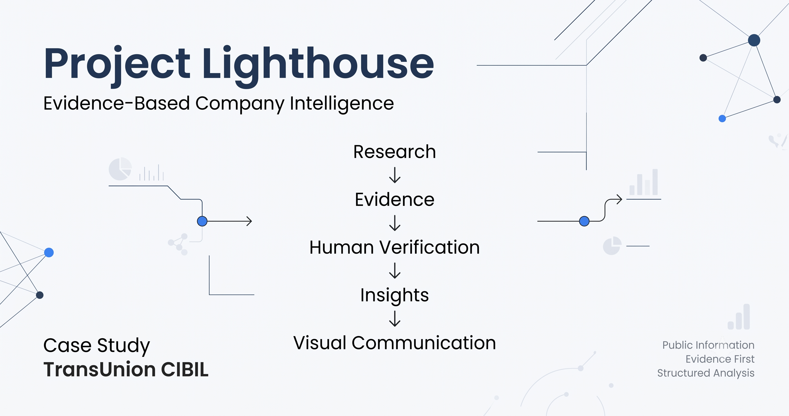

<p align="center">
  
</p>

# Project Lighthouse

### Evidence-Based Company Intelligence Case Study

> A structured analysis of **TransUnion CIBIL** built entirely from publicly available information using an evidence-first methodology.

---

## Objective

Project Lighthouse demonstrates a structured approach to researching and analyzing a company using only official public information.

Rather than producing a generic company summary, this project emphasizes:

- Evidence collection
- Human verification
- Analytical thinking
- Insight generation
- Professional documentation

---

## Project Workflow

```text
Research Questions
        │
        ▼
Official Public Sources
        │
        ▼
Evidence Collection
        │
        ▼
Human Verification
        │
        ▼
Insight Generation
        │
        ▼
Visual Communication
```

---

## Repository Overview

| Folder | Purpose |
|---------|---------|
| `00_Project_Notes` | Research planning and guiding questions |
| `01_Raw_Sources` | Verified evidence collected from official public sources |
| `02_Insights` | Evidence-backed analytical insights |
| `03_Visuals` | Workflow diagrams and visual summaries |

---

## Research Methodology

This project follows an evidence-first workflow:

1. Define research questions.
2. Collect information from official public sources.
3. Separate facts from observations.
4. Verify and remove unsupported claims.
5. Generate evidence-backed insights.
6. Present findings through structured documentation and visuals.

---

## Case Study

**Company:** TransUnion CIBIL

### Sources Reviewed

- Official Website
- Official Careers Pages

---

## Key Insights

- Analytics appears to be a core business capability.
- The company serves both enterprise institutions and individual consumers.
- Public communications emphasize business capabilities more than technical implementation details.

---

## Repository Goals

This project demonstrates the ability to:

- Conduct structured business research.
- Organize unstructured information.
- Distinguish evidence from interpretation.
- Produce traceable analytical insights.
- Communicate findings in a professional format.

---

## Disclaimer

This repository is an independent educational case study created using publicly available information.

It is **not affiliated with, endorsed by, or sponsored by TransUnion CIBIL or TransUnion**.

All observations and insights represent the author's independent analysis based solely on publicly available sources.
